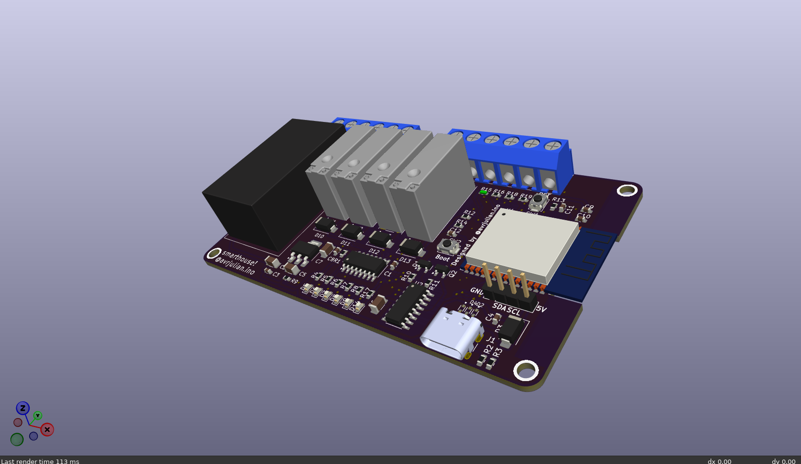
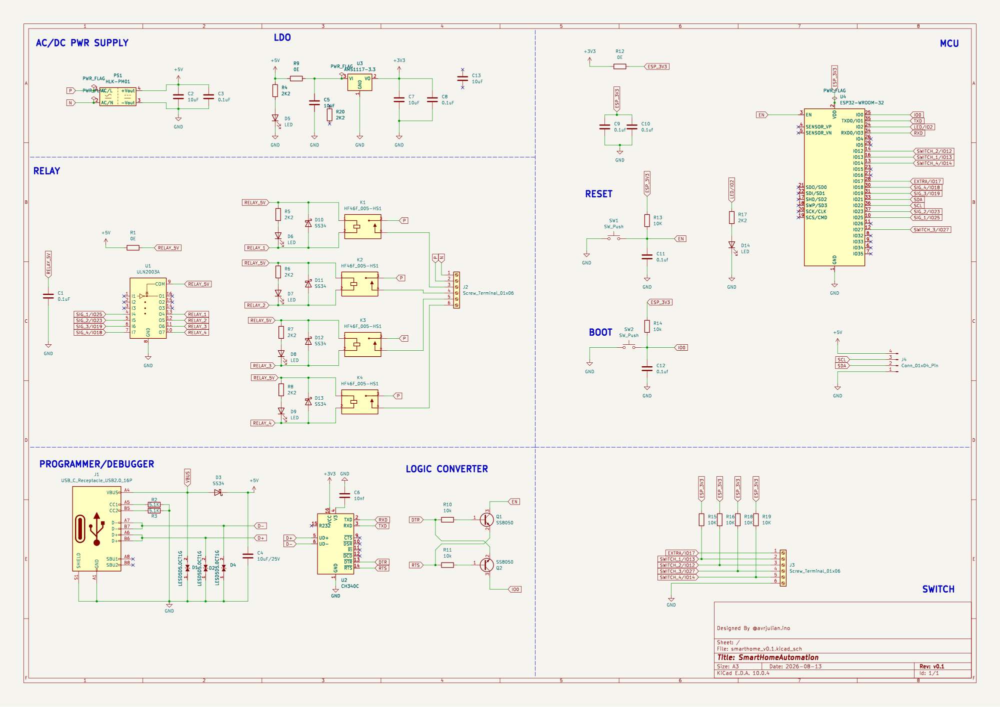
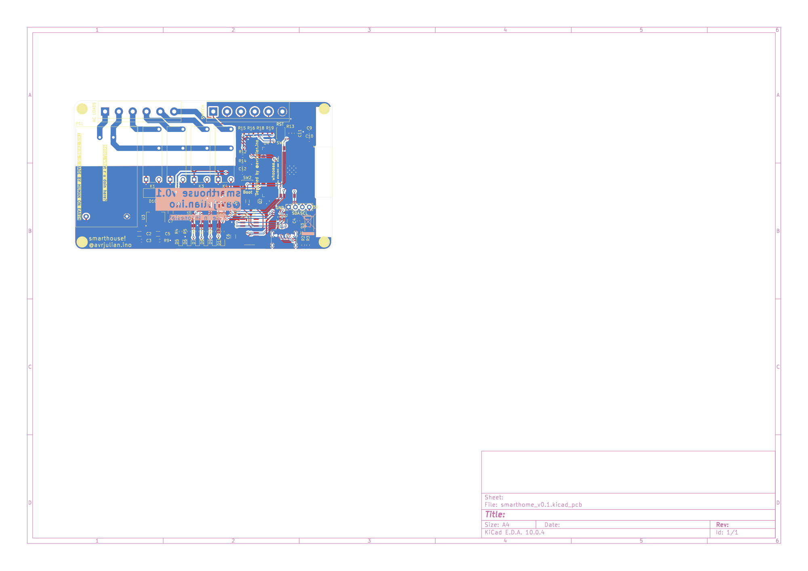
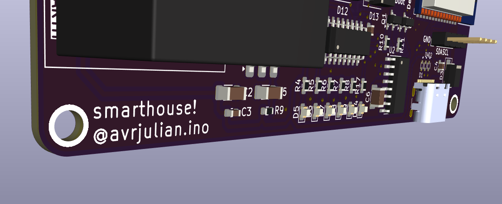
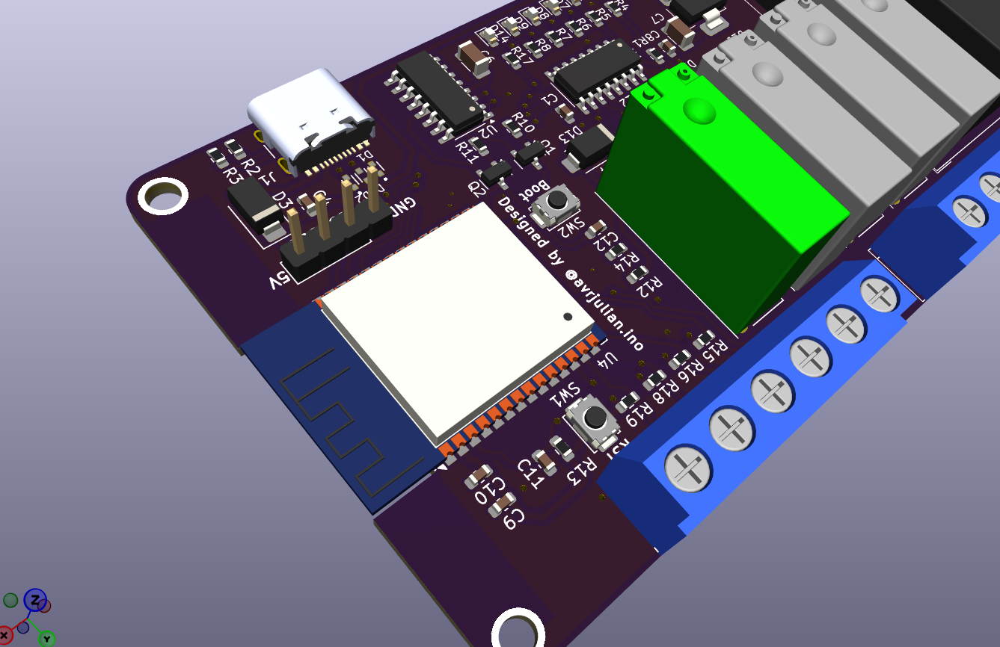

# Smart Home ESP32 Controller

I built this board because I wanted to control lights and appliances in my house over Wi-Fi without dealing with a messy breadboard full of loose wires, separate relay modules, and plug-in power adapters. Having AC mains wired to loose modules on a workbench felt unsafe and clunky.

I designed this board in KiCad so I could connect AC mains directly to an onboard power converter, switch four separate AC/DC circuits using built-in relays, connect an OLED display, and flash the ESP32 directly through USB-C.


*3D view of the smart home PCB rendered in KiCad.*

---

## What It Does

The board acts as an all-in-one 4-channel smart home controller:

1. **Power Supply**: AC mains (100V-240V AC) connects to a 5.08mm screw terminal feeding a Hi-Link HLK-PM01 step-down module, which converts AC to 5V DC. An AMS1117-3.3 linear regulator converts 5V down to 3.3V DC to power the ESP32. An SS34 Schottky diode provides reverse voltage protection.
2. **Microcontroller**: An ESP32-WROOM-32 handles Wi-Fi, BLE, and control logic. It has dedicated Reset (`SW1`) and Boot (`SW2`) tactile buttons.
3. **USB & Programming**: A USB Type-C port (`J1`) connects to a CH340C USB-to-UART bridge IC. Dual SS8050 NPN transistors (`Q1`, `Q2`) handle the automatic DTR/RTS reset circuit so code uploads directly without pressing buttons.
4. **Relay Driver**: The ESP32 controls a ULN2003A Darlington transistor array driver to safely trigger four 5V relays (`K1`-`K4`). Each relay coil has a parallel SS34 flyback diode (`D10`-`D13`) for inductive spike protection.
5. **OLED & Expansion**: A 4-pin header (`J4`) breaks out 5V, GND, SDA, and SCL for an SSD1306 128x64 I2C OLED display module. Terminal block `J3` breaks out 4 external switch inputs. Six SMD LEDs (`D5`-`D9`, `D14`) give visual status for power and relay channels.

---

## Hardware GPIO Mapping

| ESP32 Pin | Component / Net | Purpose |
| :--- | :--- | :--- |
| **GPIO 25** | Relay 1 + LED D6 (`SIG_1/IO25`) | Relay Channel 1 Output |
| **GPIO 23** | Relay 2 + LED D7 (`SIG_2/IO23`) | Relay Channel 2 Output |
| **GPIO 19** | Relay 3 + LED D8 (`SIG_3/IO19`) | Relay Channel 3 Output |
| **GPIO 18** | Relay 4 + LED D9 (`SIG_4/IO18`) | Relay Channel 4 Output |
| **GPIO 21** | OLED Display (`SDA`) | I2C Data (J4 Header Pin 3) |
| **GPIO 22** | OLED Display (`SCL`) | I2C Clock (J4 Header Pin 4) |
| **GPIO 13** | Switch Input 1 (`SWITCH_1/IO13`) | Terminal J3 Pin 1 (Wall Switch Input 1) |
| **GPIO 12** | Switch Input 2 (`SWITCH_2/IO12`) | Terminal J3 Pin 2 (Wall Switch Input 2) |
| **GPIO 27** | Switch Input 3 (`SWITCH_3/IO27`) | Terminal J3 Pin 3 (Wall Switch Input 3) |
| **GPIO 14** | Switch Input 4 (`SWITCH_4/IO14`) | Terminal J3 Pin 4 (Wall Switch Input 4) |
| **GPIO 2** | Status LED D5 (`LED/IO2`) | Heartbeat Indicator LED |
| **GPIO 0** | Switch SW2 (`IO0`) | Bootloader Button |
| **EN** | Switch SW1 (`EN`) | Reset Button |

---

## Pictures

### Schematic

*Schematic overview exported from KiCad.*

### PCB Layout

*2-layer PCB routing and silkscreen layout.*

### Detail Views

*Close-up of status LEDs, resistors, and capacitors.*


*Close-up of the ESP32 module, USB-C port, reset switches, and I2C header.*

---

## Assembly Order

If you're soldering this board yourself, build it in order of height:

1. **SMD ICs & Diodes**: Solder small ICs first (CH340C, ULN2003A, AMS1117-3.3, SS8050 transistors, TVS diodes, and SS34 diodes).
2. **SMD Passives**: Solder 0603 and 1206 resistors, capacitors, and status LEDs.
3. **USB-C Connector**: Solder the surface-mount USB Type-C port (`J1`).
4. **Tactile Buttons**: Solder the Reset (`SW1`) and Boot (`SW2`) switches.
5. **ESP32 Module**: Solder the ESP32-WROOM-32 castellated pads.
6. **Through-Hole Components**:
   * Solder the 4-pin I2C pin header (`J4`).
   * Solder the four 5V relays (`K1`-`K4`).
   * Solder the 6-pin screw terminal blocks (`J2`, `J3`).
   * Solder the HLK-PM01 AC-DC power module (`PS1`).

---

## Firmware & Software

Firmware code is located in the [`firmware/`](firmware/) folder.

It uses PlatformIO + FreeRTOS tasks to keep things readable and simple:
- **Display Task**: Periodically refreshes the SSD1306 128x64 OLED with current relay states and uptime.
- **Input Task**: Handles external wall switch inputs on terminal `J3` with debouncing.
- **Relay Task**: Drives ULN2003A inputs low or high to safely trigger relay coils.

### How to Flash

1. Open the `firmware/` directory in VS Code with PlatformIO installed.
2. Connect the board to your PC using a USB Type-C cable.
3. Build and upload:
   ```bash
   pio run -t upload
   ```

---

## Bill of Materials (BOM)

A complete BOM with part numbers, quantities, and distributor links is available in [`BOM.csv`](BOM.csv) and [`BOM.md`](BOM.md).

| Component | Qty | Specification | Purchase Link | Total Cost ($) |
| :--- | :---: | :--- | :--- | :---: |
| ESP32-WROOM-32 | 1 | ESP32-WROOM-32-N4 | [LCSC C82899](https://www.lcsc.com/product-detail/WiFi-Modules_Espressif-Systems-ESP32-WROOM-32-N4_C82899.html) | $2.75 |
| 5V Relays (Hongfa/Songle) | 4 | HF46F-005-HS1 5V 5A | [LCSC C38573](https://www.lcsc.com/product-detail/Relays_Hongfa-America-HF46F-005-HS1_C38573.html) | $1.80 |
| Relay Driver IC | 1 | ULN2003A SOIC-16 | [LCSC C14881](https://www.lcsc.com/product-detail/Darlington-Transistor-Arrays_STMicroelectronics-ULN2003D1013TR_C14881.html) | $0.18 |
| OLED Display | 1 | 0.96" 128x64 I2C SSD1306 | [LCSC C2836248](https://www.lcsc.com/product-detail/OLED-Displays-Modules_KMR-KMR-0-96-OLED-W_C2836248.html) | $1.85 |
| Tactile Switches | 2 | 3x6mm SMD Push Button | [LCSC C318884](https://www.lcsc.com/product-detail/Tactile-Switches_C318884.html) | $0.10 |
| AC-DC Module | 1 | HLK-PM01 5V 3W | [LCSC C209743](https://www.lcsc.com/product-detail/Power-Modules_Hi-Link-HLK-PM01_C209743.html) | $2.80 |
| LDO Regulator | 1 | AMS1117-3.3 SOT-223 | [LCSC C6186](https://www.lcsc.com/product-detail/Linear-Voltage-Regulators-LDO_Advanced-Monolithic-Systems-AMS1117-3-3_C6186.html) | $0.08 |
| USB Serial Bridge | 1 | CH340C SOIC-16 | [LCSC C84681](https://www.lcsc.com/product-detail/USB-Drivers-Receivers-Transceivers_WCH-Jiangsu-Qinheng-Microelec-CH340C_C84681.html) | $0.32 |
| USB-C Connector | 1 | 16-Pin SMD Receptacle | [LCSC C165948](https://www.lcsc.com/product-detail/USB-Connectors_HCTL-HC-TYPE-C-16P-01A_C165948.html) | $0.15 |
| Screw Terminals | 2 | 6-Pin 5.08mm Pitch | [LCSC C8456](https://www.lcsc.com/product-detail/Pluggable-System-Terminal-Block_C8456.html) | $0.70 |
| **TOTAL BOM COST** | | | | **$11.21** |

---

## Known Issues & Notes

* **Physical Board Testing**: The PCB layout passes all KiCad DRC and ERC checks with zero errors, and the firmware compiles with zero errors under PlatformIO (`pio run`), but I have not physically uploaded and tested this firmware on the manufactured PCB yet.
* **High-Voltage Safety**: High-voltage AC mains connects to `PS1` and terminal `J2`. Be careful when handling power and mount the board inside a 3D-printed case.

---

## Credits

* **KiCad Libraries**: Standard KiCad symbols and footprints for ESP32, CH340C, ULN2003A, and passives.
* **Adafruit GFX / SSD1306**: OLED display libraries.
